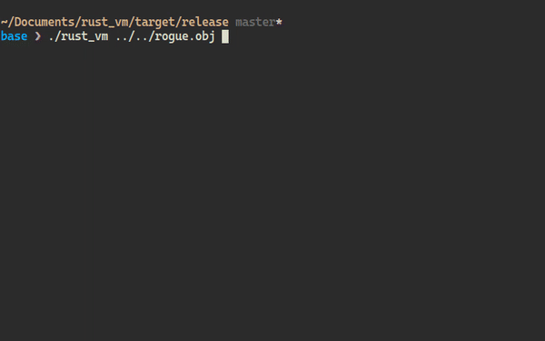
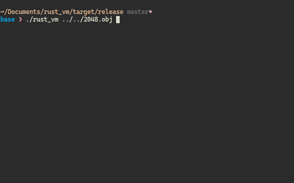
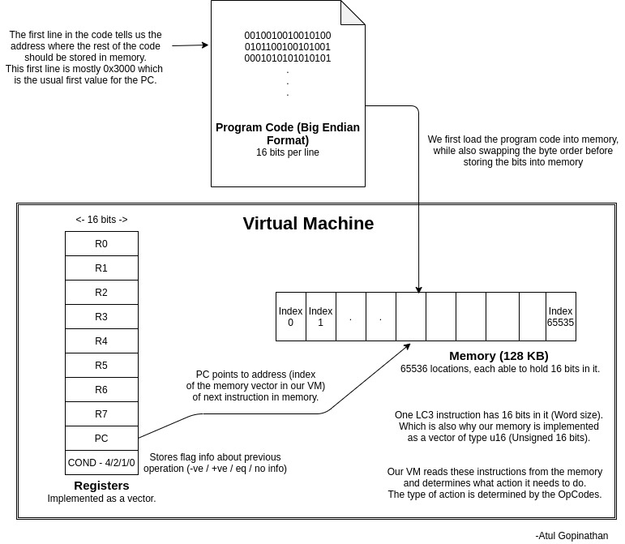

# Rust VM
A Virtual Machine written in Rust to emulate the LC3 computer (Little Computer 3) and a re-implementation of the C code version of the same.

## Usage
1. Running it is simple, download the `rust_vm` binary release provided here.
2. Download the [2048.obj](https://justinmeiners.github.io/lc3-vm/supplies/2048.obj) or [rogue.obj](https://justinmeiners.github.io/lc3-vm/supplies/rogue.obj). Ideally, it should be able to run any other LC3 assembly code.
2. Run `./rust_vm /path/to/lc3_assembly`. Example: `./rust_vm rogue.obj`.
3. NOTE: This VM code has been written specifically to run in Unix like Operating Systems. The binary may or may not run in Windows machines.

## Preview
### Rogue game

### 2048 game

## More About the VM
1. Here is a simple diagram I made representing the workflow of the VM:  

2. The memory and register are the main hardware that are emulated. Rest of our code is mainly focused on reading the instructions from memory, determining what type of instruction it is (Op-code), and performing the corresponding actions. To understand the different op-codes/type of instructions that our VM should be able to perform, refer this [PDF](https://courses.engr.illinois.edu/ece411/fa2019/mp/LC3b_ISA.pdf).

## Notes
1. The LC3 assembly codes are stored in Big-Endian byte order while my PC has an x86-64 architecture storing words in Little-Endian Formats. That's why, in the code, while reading programs into our emulated memory, certain swapping was done to store the bytes in Little Endian order.
2. Rust doesn't directly provide wrapping of integer overflow which is normal in C code. The LC3 assembly code also uses this wrapping of integer overflow extensively while adding addresses with offsets (see code in `src\opcode_fn.rs`). I had to use Rust's `wrapping_add()` function for this case.
3. Default behaviour of standard consoles are to get input from a user and process them only when a newline character is entered (hitting the enter button). In order to play the games, the default behaviour for the terminal needed to be changed. I referred this [answer](https://stackoverflow.com/a/37416107/11105624) in stackoverflow and used an external crate `termios` to solve this. This is also the part where certain platform specific codes were written.
4. I wrote Index trait implementations for certain enums in order to use them as indexes for vectors directly.
